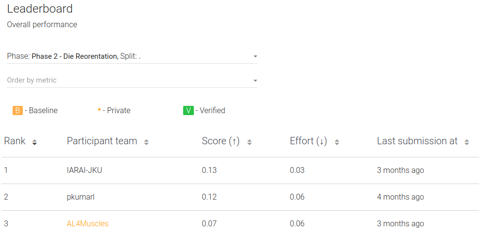

# MyoChallenge - IARAI-JKU
This package contains the wining solution for the [MyoChallenge](https://sites.google.com/view/myochallenge/myochallenge) die reorient task. This is adapted from [EvoTorch starter baseline](https://github.com/nnaisense/evotorch-myosuite-starter).




## Methodology

We build upon the evotorch baseline which uses PGPE and the ClipUp optimizer on a 3 layer RNN. Our primary approach to solving this hard exploration challenge is by using potential function based reward shaping [refer to [RUDDER](https://ml-jku.github.io/rudder/), Arjona-Medina et al. for a detailed overview] and task subdivision using adapting curricula [Similar to POET, Wang et al.]. We have a population of environments (256), each of which starts of at "easy" difficulty and adapts its difficulty based on the success achieved by the agent in the recent past (20 episodes). The environment difficulty is controlled using the goal_rot value. Hence, the difficulty distribution is shaped by the agent's current performance.

Our recently published [work](https://openreview.net/forum?id=9CvMkA8oi8O)(At the DRL workshop in NeurIPS 2022) shows that minimizing task-irrlevant exploration speeds up learning and improves generalization. This is because visiting task-irrelevant states forces the policy/value networks to fit irrelevant targets that affect their capacity and generalization capabilities. This was also our primary motivation for entering the challenge, to verify some of our ideas on the challenging continuous control tasks posed here.

Essentially, using a reward function based on the differences of a potential function avoids spurious optima (E.g. committing suicide) and also provides a much easier to optimize reward. (Since, it's always possible to obtain a positive reward at every state). Further, the curriculum minimizes task-irrelevant exploration speeding up learning and allowing the trained policy to generalize much better to downstream tasks in the curriculum.

## Authors
- [Rahul Siripurapu](https://github.com/rahulsiripurapu)
- [Luis Eduardo Ferro Diez](https://github.com/Ohtar10)
- [Vihang Patil](https://github.com/vihangp)

Special thanks to Prof. Sepp Hochreiter & Dr. Michael Kopp for their guidance and support.

## Setup
1. Create Conda Environment
```bash
conda env create -f env.yml
```

2. Run Jupyterlab
```bash
conda activate iarai-jku-myochallenge
jupyterlab
```

3. Run `train_die_reorient.ipynb`. Further instructions and explanations can be found there.

